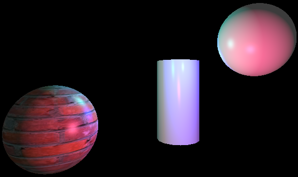

# Godot Abstracted Phong
 Godot Phong shader written from scratch, mostly as a learning experience.

 # Features
 - Texture Support
 - World Environment Ambient Colour Support
 - Plug and Play implementation with Godot's lights
   
  - Light Colour
  - Attenuation
  - Range
  - Energy

# Showcase
( 3 Light sources, Red Green and Blue. )

