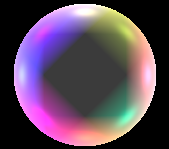

# Godot Abstracted Phong
 Godot Phong shader written from scratch, mostly as a learning experience.

 # Features
 - Texture Support
 - World Environment Ambient Colour Support
 - Supports 8 Active Lights per Object
 - Plug and Play implementation with Godot's lights
   
   - Light Colour
   - Attenuation
   - Range
   - Energy

## Showcase
( 3 Light sources, Red Green and Blue. )

( 8 Active Lights on one Mesh)

## How to Use:

1. Download the shader from the Releases section.
2. Import the shader into your Godot project.
3. Assign a Shader Material to your Mesh's Material.
4. Load the Phong shader into the Shader Material.

You can adjust the properties in the Shader Parameters.
